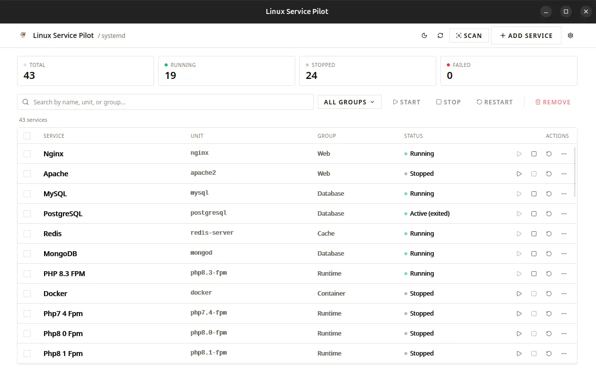
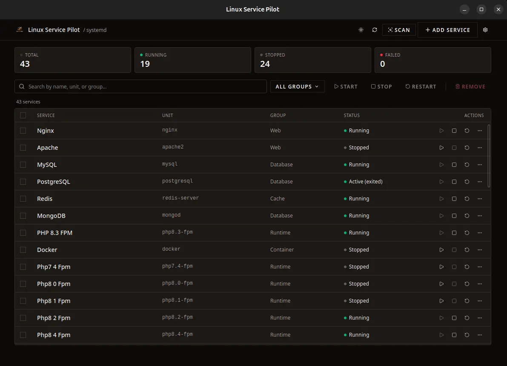
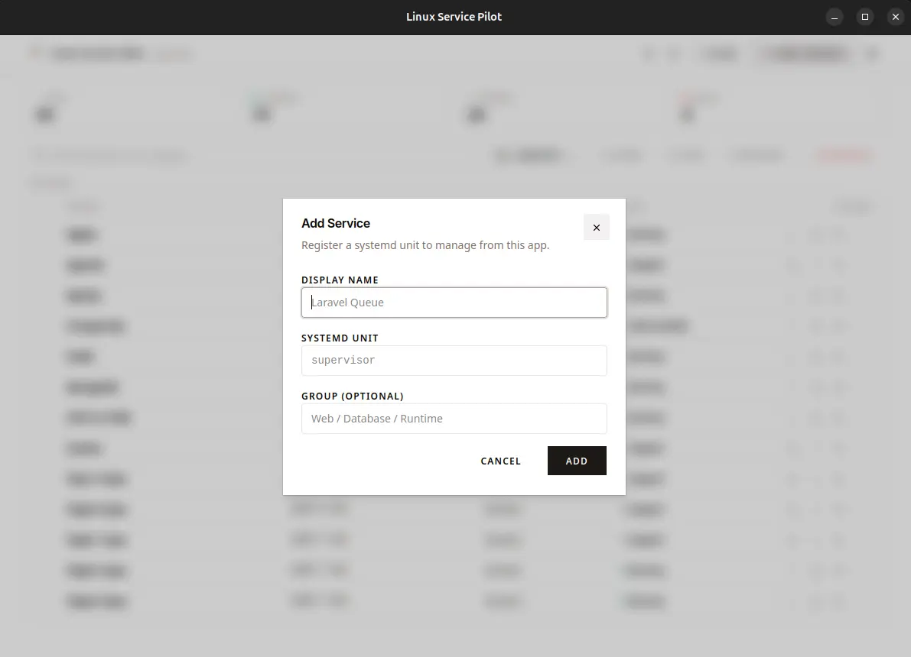
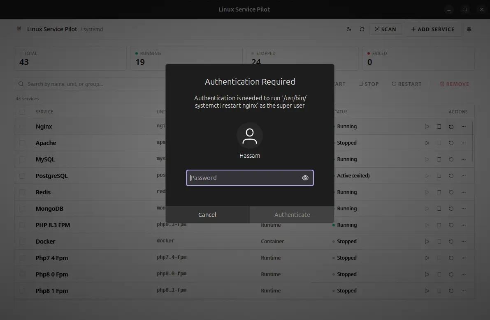
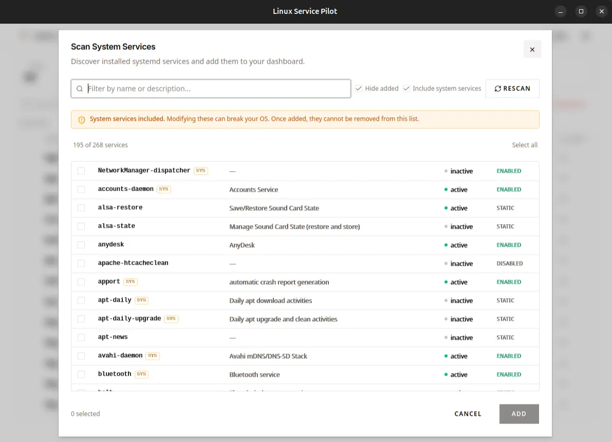
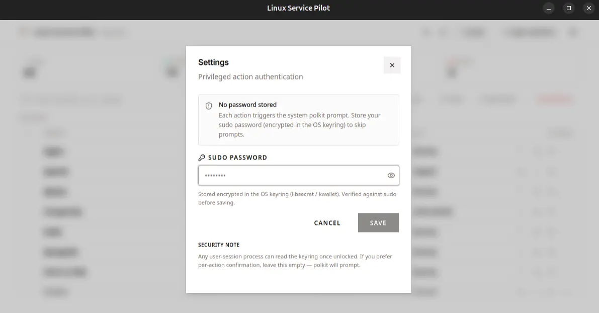
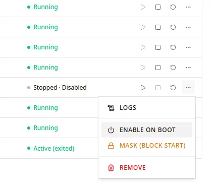

# Linux Service Pilot

A fast, native desktop dashboard for managing systemd services on Ubuntu/Linux. Built with Tauri + Rust + React.



## Quick Start

### 1. Install prerequisites (Ubuntu / Debian)

```bash
sudo apt update
sudo apt install -y \
  build-essential curl wget file pkg-config \
  libssl-dev libwebkit2gtk-4.1-dev libayatana-appindicator3-dev \
  librsvg2-dev libxdo-dev libglib2.0-dev libgtk-3-dev
```

Install Rust (stable toolchain):

```bash
curl --proto '=https' --tlsv1.2 -sSf https://sh.rustup.rs | sh
source "$HOME/.cargo/env"
```

Install Node 20+ and pnpm:

```bash
curl -fsSL https://get.pnpm.io/install.sh | sh -
```

### 2. Clone and run

```bash
git clone https://github.com/hassamulhaq/linux-service-pilot-tauri.git
cd linux-service-pilot-tauri
pnpm install
pnpm tauri dev
```

The first launch opens an empty dashboard and auto-triggers a system scan so you can pick which services to manage.

### 3. Build a Linux package

```bash
pnpm tauri build
```

Artifacts land in `src-tauri/target/release/bundle/`:

| Format | Path |
|---|---|
| `.deb` (Debian/Ubuntu) | `bundle/deb/linux-service-pilot-tauri_<version>_amd64.deb` |
| `.rpm` (Fedora/openSUSE) | `bundle/rpm/linux-service-pilot-tauri-<version>-1.x86_64.rpm` |
| `.AppImage` (portable) | `bundle/appimage/linux-service-pilot-tauri_<version>_amd64.AppImage` |
| Raw binary | `src-tauri/target/release/linux-service-pilot-tauri` |

Install the deb:

```bash
sudo dpkg -i src-tauri/target/release/bundle/deb/linux-service-pilot-tauri_*_amd64.deb
sudo apt -f install   # resolve any missing runtime deps
```

Or run the AppImage directly:

```bash
chmod +x src-tauri/target/release/bundle/appimage/linux-service-pilot-tauri_*.AppImage
./src-tauri/target/release/bundle/appimage/linux-service-pilot-tauri_*.AppImage
```

To skip building formats you don't need, pass `--bundles`:

```bash
pnpm tauri build --bundles deb       # only .deb
pnpm tauri build --bundles appimage  # only AppImage
```


## Features

- **Service dashboard** — start, stop, restart, view logs in one click
- **System scan** — discover installed systemd units; optional toggle to include core/system services
- **Bulk actions** — multi-select services to start/stop/restart/remove together
- **Real-time status** — polls `systemctl` every 3 seconds; reflects changes made from the terminal
- **Search + group filter** — quickly locate services across large lists
- **Logs viewer** — last 300 lines from `journalctl -u <unit>`
- **Custom services** — add any systemd unit (e.g. `php8.3-fpm`, `supervisor`) with auto-grouping
- **Sudo keyring** — optionally store sudo password in OS keyring (libsecret/kwallet) to skip polkit prompts; falls back to pkexec
- **System-service guard** — units matching core patterns (systemd-, dbus, polkit, gdm, snap, etc.) are flagged and cannot be removed
- **Dark / light theme**

## Screenshots

| | |
|---|---|
|  |  |
|  |  |
|  |  |

## Stack

| Layer | Tech |
|---|---|
| UI | React 19, TypeScript, Vite, Tailwind v4, shadcn/ui (Radix-Sera), Lucide |
| Runtime | Tauri 2 |
| Backend | Rust |
| OS integration | `systemctl`, `journalctl`, `sudo -S` / `pkexec`, OS keyring |

## Architecture

```
React UI
   ↓ invoke()
Tauri commands (Rust)
   ↓
systemctl / journalctl / OS keyring
```

Service actions are whitelisted: only units registered in the user config can be passed to `systemctl`. Unit names are validated against a strict character set to prevent injection.

## Configuration

User config is persisted at `~/.config/linux-service-pilot/services.json`.

## Author

Hassam Ul Haq — [github.com/hassamulhaq](https://github.com/hassamulhaq)
